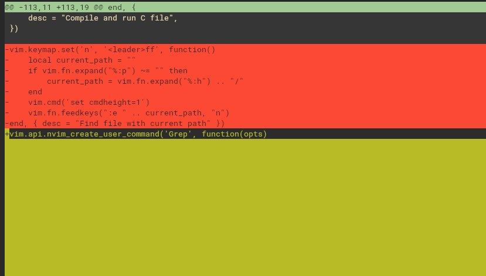
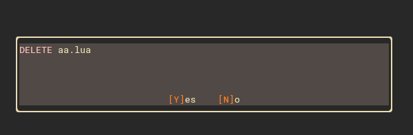

## TODO
- Fix highlighting of diffs in neogit w/ gruvbox  
- Fix oil.nvim alert dialog highlighting w/ gruvbox  
- Add a keymap to copilot chat history
    - Use Snacks.scratch.select() as base for the ui maybe
- Find a way to show debug breakpoints without fold column
